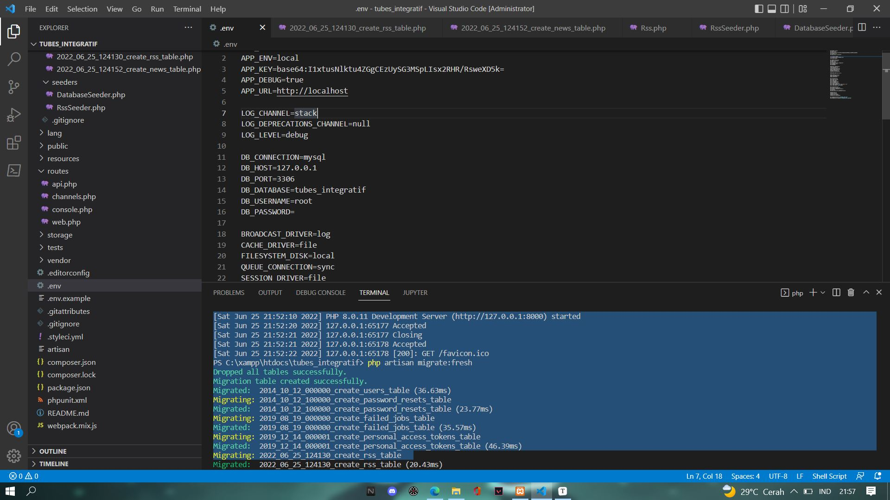
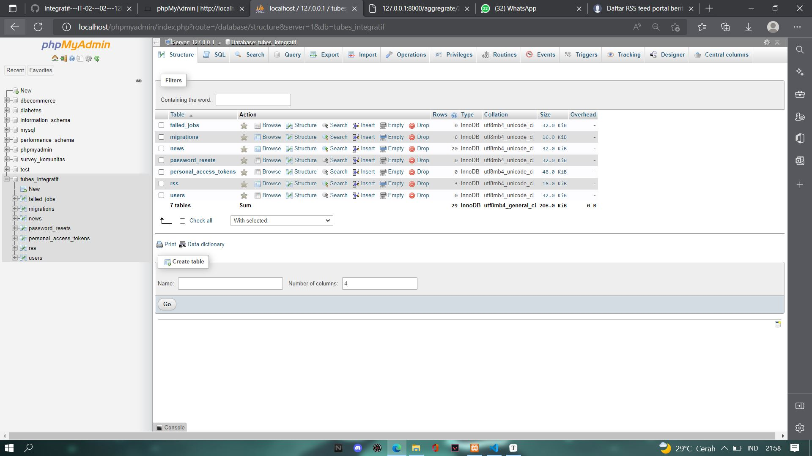
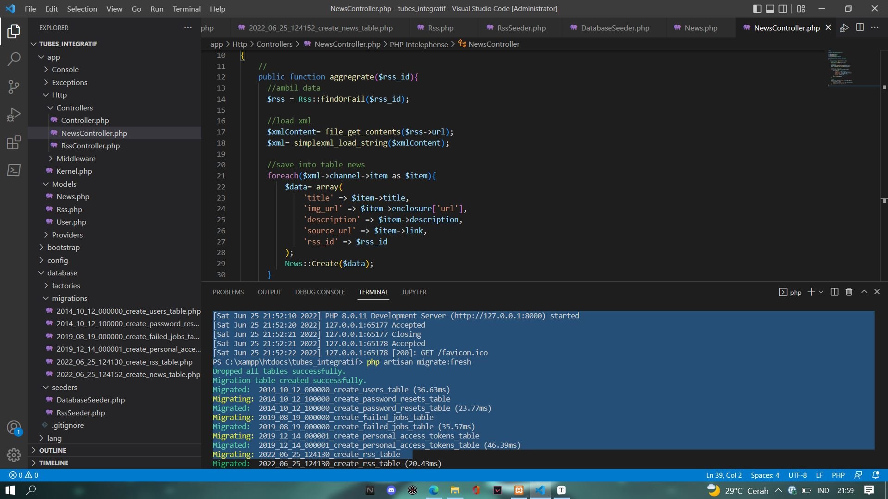
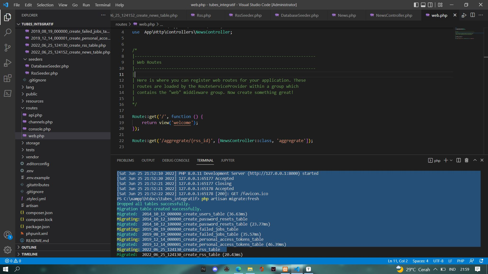
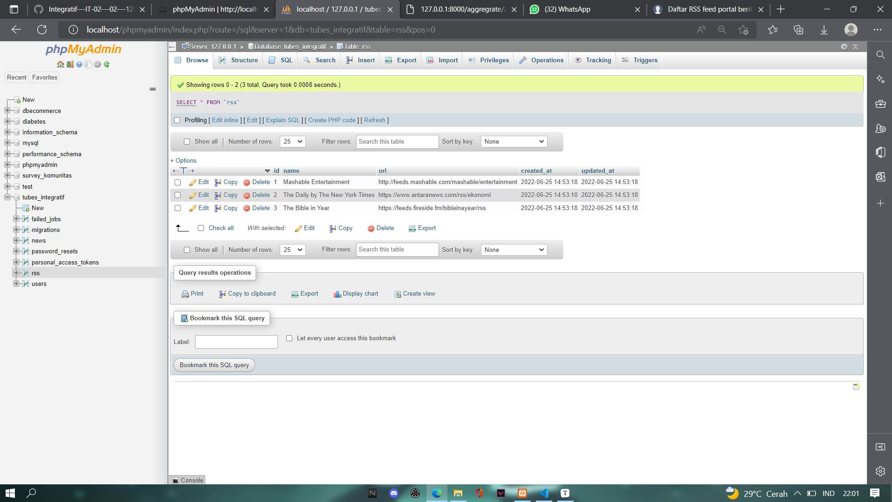
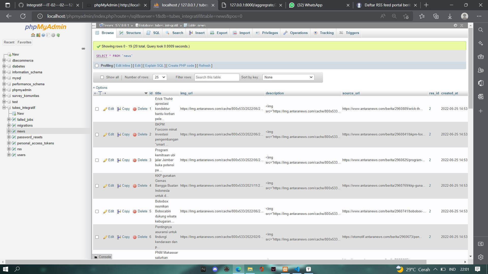
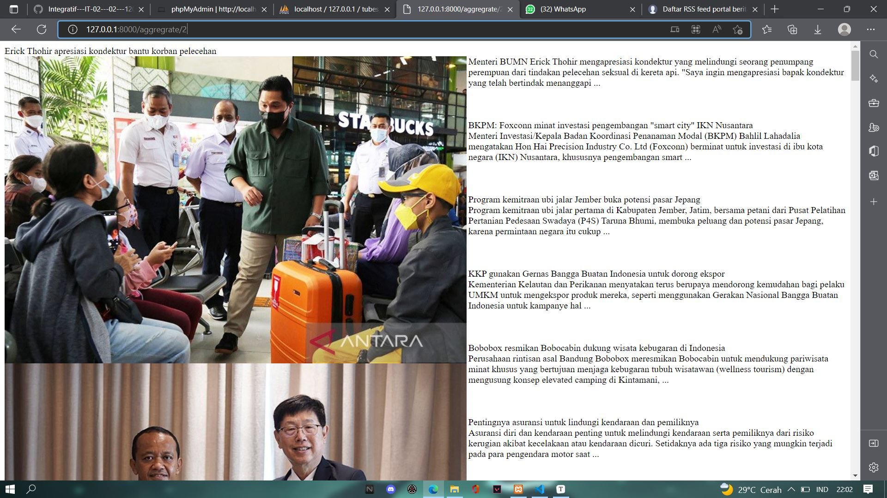

# Integratif---IT-02---02---1202190011
**Tahap 2 RSS**

1. Langkah pertama, ubah nama DB_DATABASE di .env sesuai dengan nama database yang sudah dibuat di php my admin

   

   

2. Buat file RssController.php dan NewsController.php di app/http/controllers

   ```markdown
   php artisan make:controller RSSController
   php artisan make:controller NewsController
   ```

3. Coba jalankan migration dan seeding dengan perintah berikut :

   ```markdown
   php artisan migrate:fresh
   php artisan migrate --seed
   ```

4. Setelah sukses menjalankan perintah 3, lanjutkan dengan edit file di NewsController.php

   

5. Jika sudah berhasil menjalankan perintah sebelumnya, tambahkan sebuah Route di web.php

   

6. Cek database di php my admin, untuk melihat apakah sudah terupdate atau belum

   

   

7. Langkah terakhir lakukan pengecekan RSS apakah sudah berhasil atau belum

   
   
   **Tahap 3 RSS**
Berikut ditampilkan halaman RSS yang telah dibuat

Berikut Link RSS yang digunakan :


1. https://www.antaranews.com/rss/ekonomi
2. https://feeds.fireside.fm/bibleinayear/rss
3. https://news.un.org/feed/subscribe/en/news/topic/economic-development/feed/rss.xml
